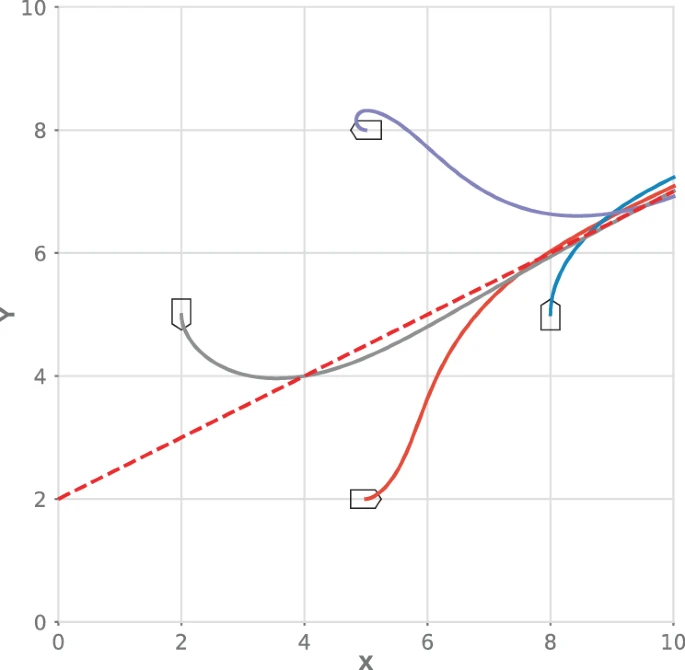
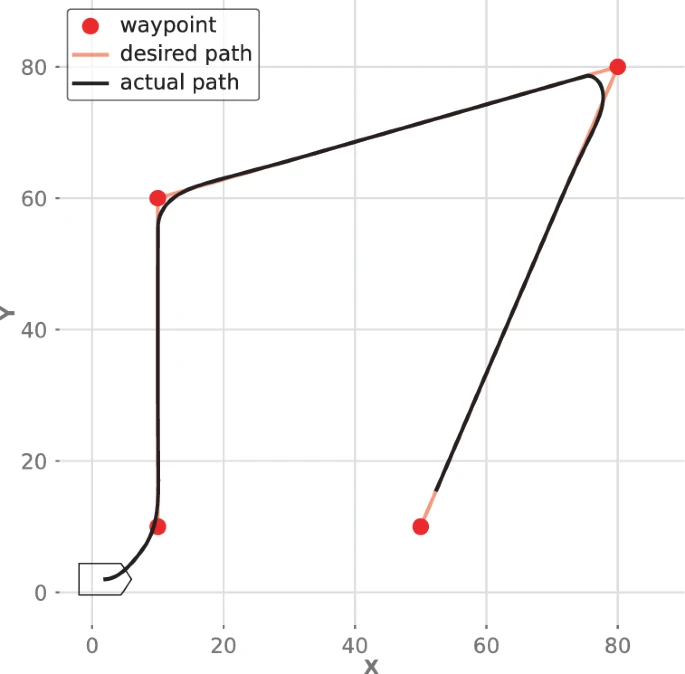
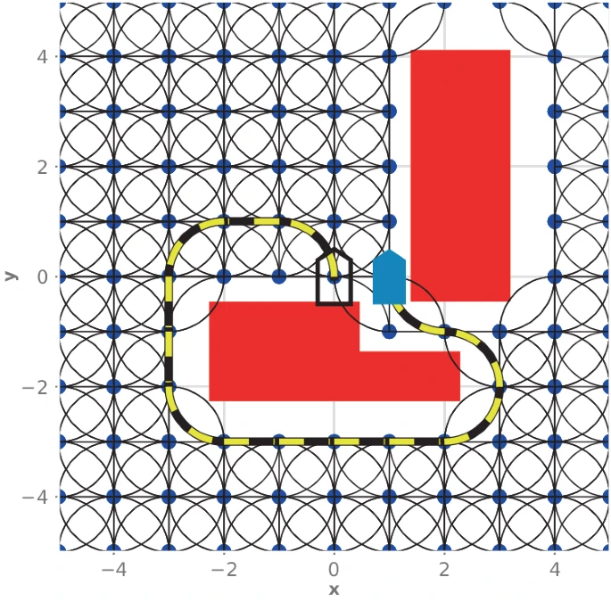
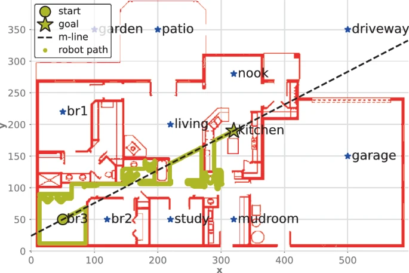
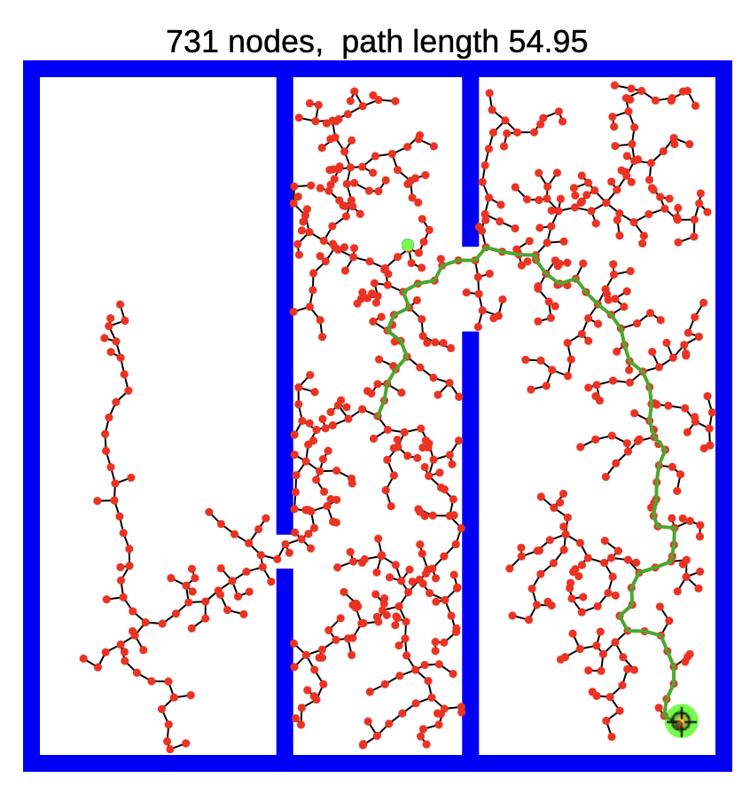

# Navi24W2
Navigation's 2024 term 2 work.

The goal for this term is to explore navigation fundamentals as well as path planning given a simple map (maybe deep learning as well).

## Past work:  
From term 1 we came out with some reactive navigation models.

Hough algorithm

CenterRowAlgorithm

## This term:  

There are three big areas to explore this term:

### 1. Planning drivable paths: 
How can we get Agrobot to get to a point given its constrained movement (Ackermann steering)? 

Use this chapter of the textbook to help you with this challenge.  
https://link.springer.com/chapter/10.1007/978-3-031-06469-2_4  
This chapter gives the intro to the topic and is where the last image comes from:  
https://link.springer.com/chapter/10.1007/978-3-031-06469-2_5#Sec21

### 2. More advanced reactive path planning
Bug algorithm:  
 - This seems very good for Task 1

Potential Field Algorithm:  
 - This seems very good for Task 1. How can we place attracting forces to guide the
   robot around crop rows?  

Random Tree Algorithm (RRT/RRT*):  
This resouce is amazing for visualizing RRT: https://demonstrations.wolfram.com/RapidlyExploringRandomTreeRRTAndRRT/  
 - This one looks useful for exploring an unknown area for weeds, ie Task 3 for FRE.  
 - For a robot to use this algorithm it would need to be tweaked so it does not need to backtrack so much, what is the best way to do this?

### 3. Image processing
All of these can be found in ch 11 of this textbook:  
https://link.springer.com/chapter/10.1007/978-3-031-06469-2_11

More advanced image processing can be found in chapter 14, like stiching images together:  
https://link.springer.com/chapter/10.1007/978-3-031-06469-2_14#Sec34

Monadic Operations
thresholding, histogram normalization, gamma correction, ...

Edge detection  
There is no way this is not useful

Boundary Detection  
Same story as Edge detection

Distance transform  
Maybe useful for preprocessing, definitely  useful for some path planning applications.

Template matching?  
Not likely that useful but cool to do image detection without ML

Noise Cleanup  
Likely not that useful, but cool

### There is also always Gazebo:  
Look into:
https://github.com/FieldRobotEvent/virtual_maize_field
https://github.com/UBCAgroBot/navigation-2019-2023

## FRE Resources
FRE resouces can be suprisingly elusive so if you find anything interesting put it here.

FRE Website:
https://fieldrobot.nl/event/

FRE 24 Competition guidelines:
https://fieldrobot.nl/event/wp-content/uploads/2024/04/Rules_FRE24_V4.pdf

Youtube video with footage of robots completing the challenges:  
https://www.youtube.com/watch?v=bHzV4xi0JQk&t=78s

## Interesting Links:

Sample code for robotics algorithms:  
https://github.com/AtsushiSakai/PythonRobotics

Advanced motion planning, planning under uncertainty, sensor-based planning, reinforcement learning, nonlinear systems, trajectory planning, nonholonomic planning:  
http://lavalle.pl/planning