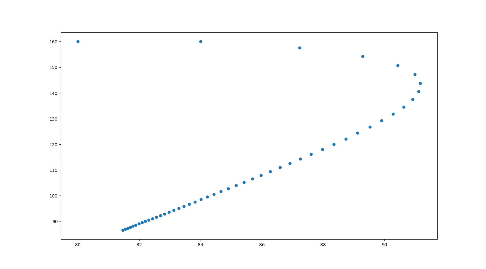
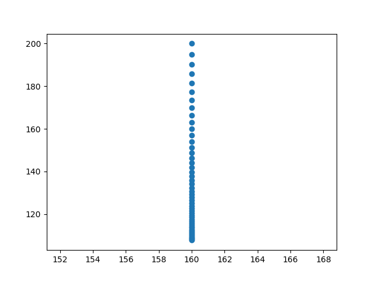
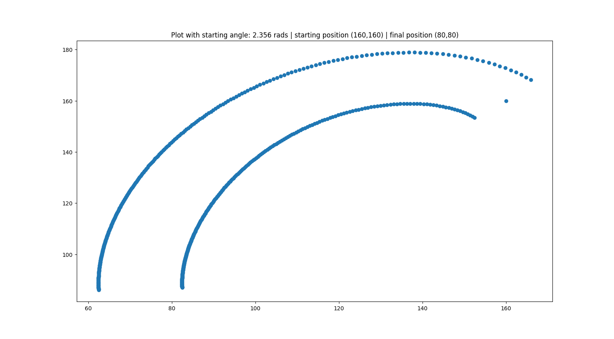

Given an arbitrary starting point,starting angle, and endpoint. We can generate a path our robot can traverse to get to the end point given our steering constraints.

This image shows how even if our car is facing right "downwards" given steering constraints.

Here we can see that if we are able to go directly to our path we will.

With adjusted parameters, rather than viewing the robot as a single point, we can create plots where the points represent the position of the wheels on the robot

The code for this is in:
`filip_canak_rrt/realistic_drive.py`

