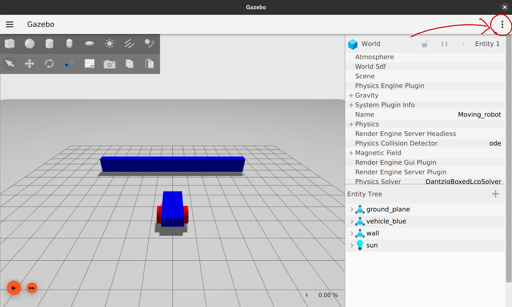
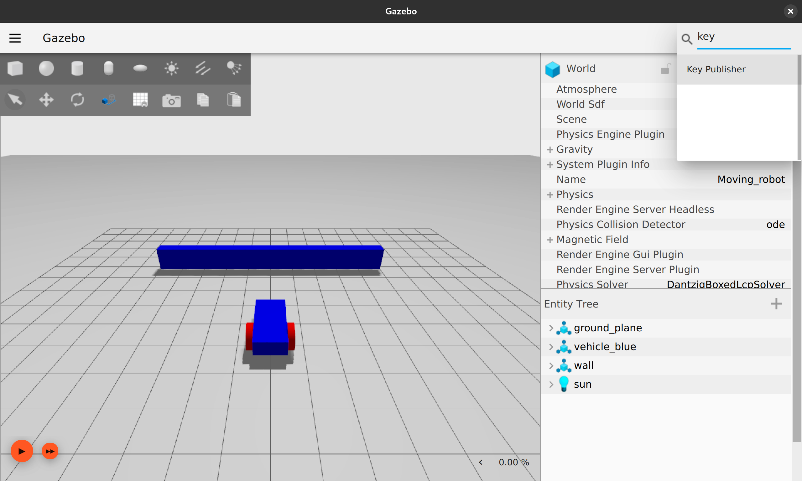
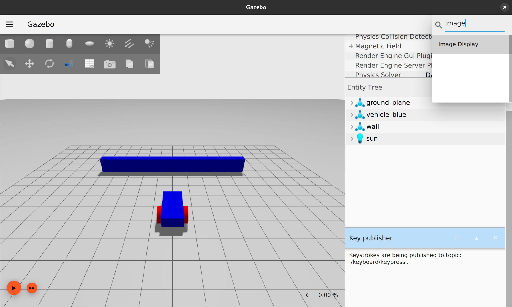
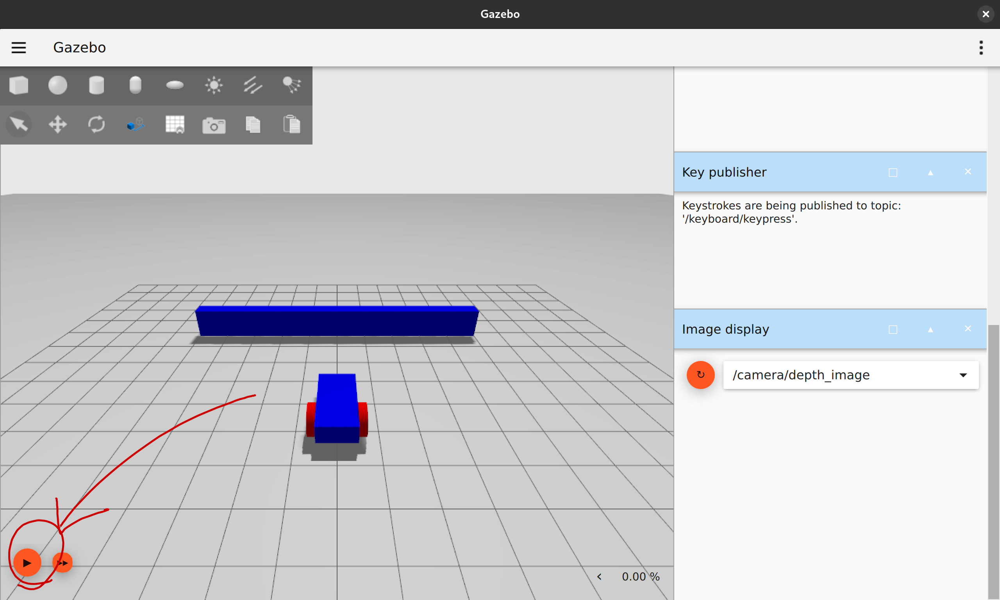

# Gazebo docs

## Setup
**NOTE:** There is absolutely no guarantee that this will work for you

Make sure you have an X server installed. If you're on Linux, it should be there
already. If you're not on Linux, have fun :)

Now, build the docker container:
```bash
docker compose up --build
```
If there are errors try commenting out lines in the `compose.yml` file. 
Or, just message me :)

## Usage
Enter the docker container using
```bash
./enter.sh
```
This will put you in a bash shell. There is a preliminary VSCode devcontainer
configuration, but it does not work in my experience.

### Launch Gazebo
There is a little tool to make launching gazebo more convenient.

In the container, run
```bash
gzl
```
This will open a little box. Click the `Select SDF File` button, then navigate
to `/home/vscode/Worlds`. Inside there are a variety of Gazebo worlds.
The most interesting one is `MovingRobot.sdf`.

Now click `Launch in Gazebo` to open the scene in Gazebo. The little box 
will stay up, and is useful for restarting gazebo.

### Development Workflow
Gazebo has no form of hot reloading. And configuring Gazebo's GUI is
rather difficult. I'll do it at some point...

I edit my sdf scenes in an external program (Outside of the container). When I want
to view my changes, I close Gazebo, and launch it again from the little tool.

**DO NOT RUN MULTIPLE INSTANCES OF GAZEBO AT THE SAME TIME!**
Strange things will happen.

### MovingRobot scene
This scene features a moveable robot with an IMU and an RGBD camera.
The camera is setup to be the same framerate, resolution, and FOV as the Zed Camera 2i.

However, after you open it, you need to do some configuration.

Open the scene. Click on the three dots.


Add a key listener if you wish to control the robot with the keyboard.


Add an image viewer so you can see the camera output


Now, press the start button to start the scene


Now you should be able to drive aroung the scene using the arrow keys!


In the image viewer section you can switch to viewing the camera feed instead.
